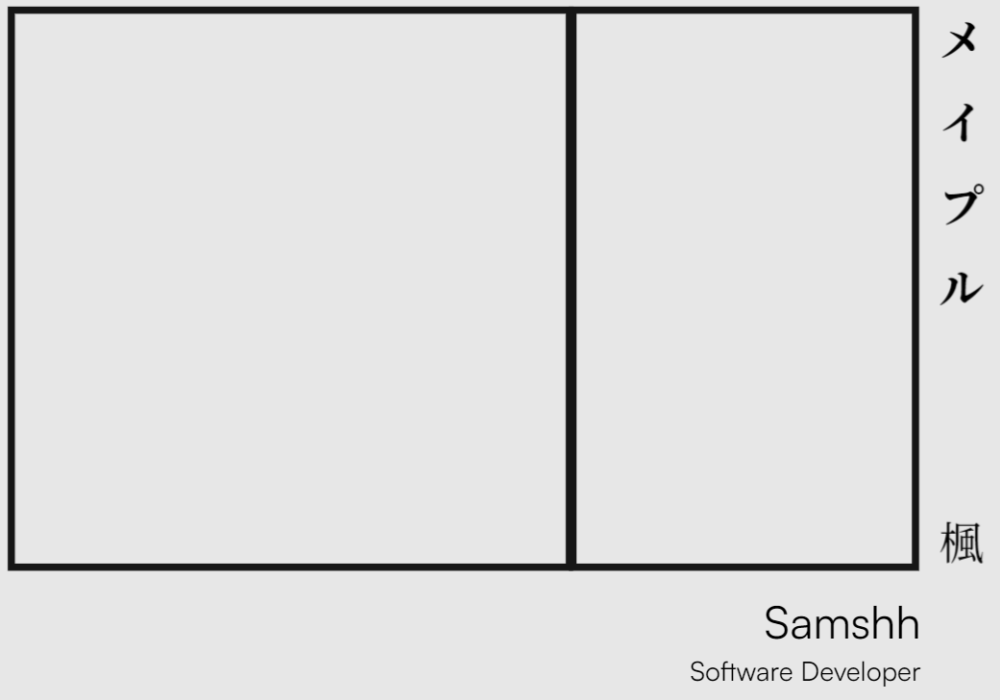
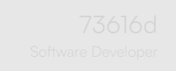
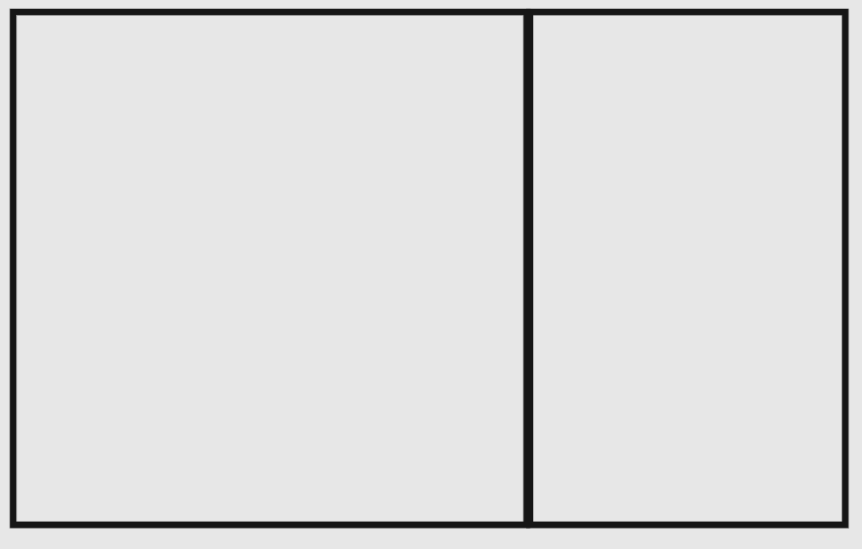
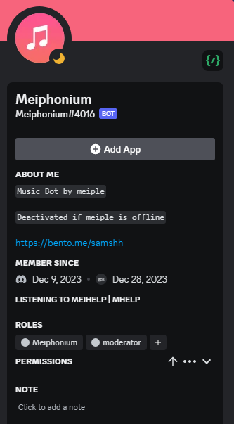

# Samshh Logo

- メイプル - means meiple　
- 楓 - means kaede in english maple
- samshh - from my name sam
- 73616d fade-in-out animation - the hexadecimal value for sam in ASCII
  

- The 2 boxes represents the computer monitor and the computer case

__[link](https://samshh.netlify.app/) and [source code](https://github.com/Samshh/landingPage) of the website__
## Gestalt Properties
- Similarity - the use of mono chromatic colors of my logo shares the same color of 0x171717 or dark gray
- Proximity - the different elements of the logo are grouped together
- Continuity - the elements of the logo are arrenged in a line
# Meiphonium Logo (Music Bot)
.png>)

- This logo is used outside of discord
- mei - is derived from meiple my IGN
- phonium - is from euphonium a brass instrument that produces sound
- musical note - represents music
### In-app discord Logo
- removed the texts and leaves out the music note for cleaner in-app logo

__The bot's logo in it's discord profile__

__The bot playing music__

## Gestalt Properties
- Closure - the music note automatically indicates that it produces sound to the user
- Symmetry - the base and the logo in it's entirety is symmetrical as a group
- Similarity - use of similar colors in font
- Figure-ground - the texts is the figure and the gradient background is the ground
__[Invite my bot to your server!](https://discord.com/api/oauth2/authorize?client_id=1182877339508555857&permissions=139589897280&scope=applications.commands%20bot)__
